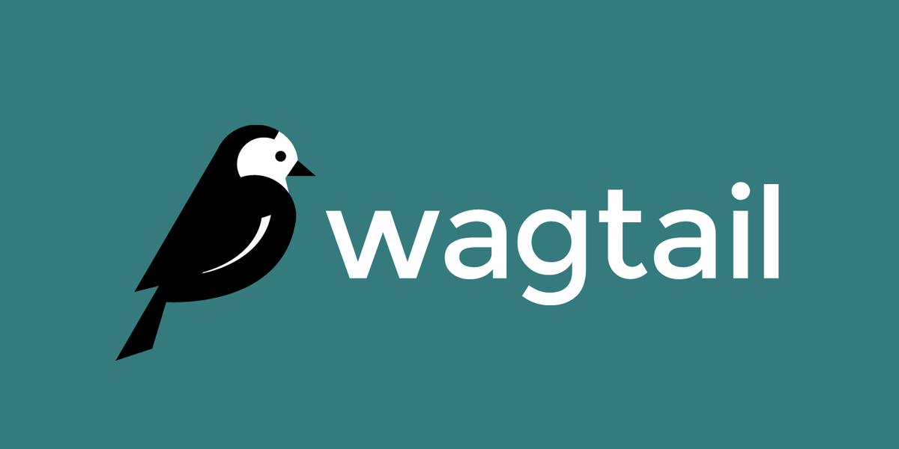
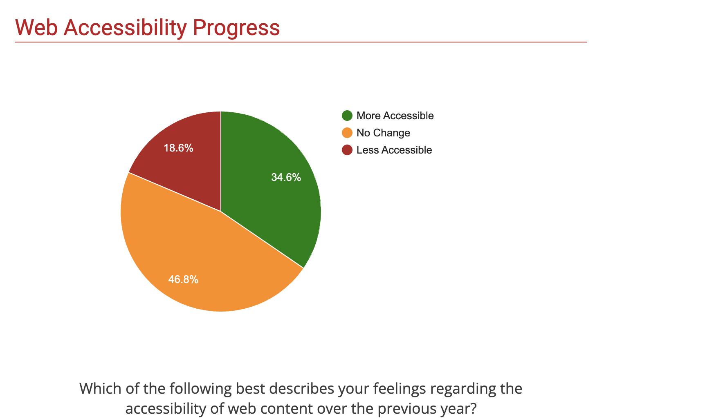
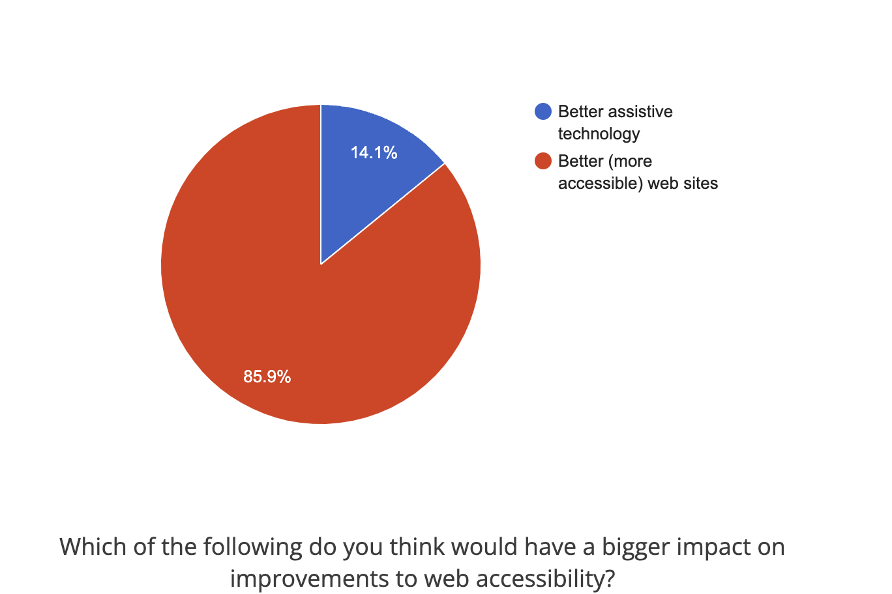
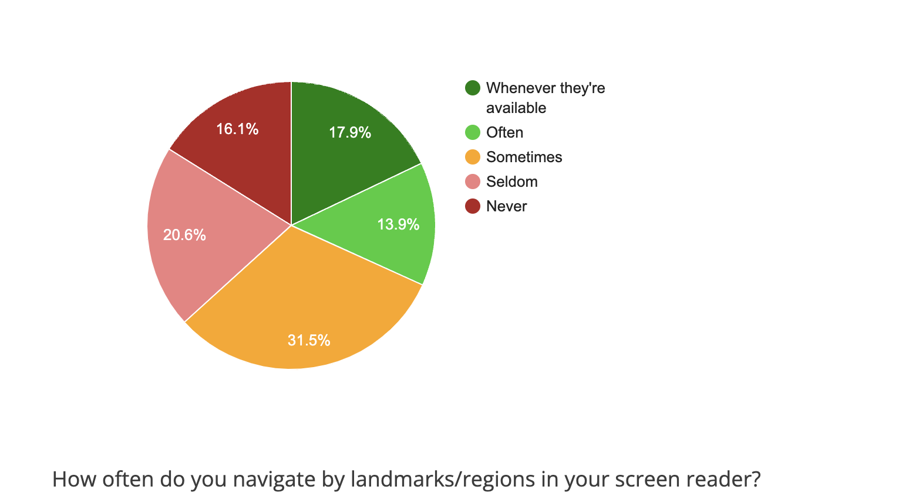
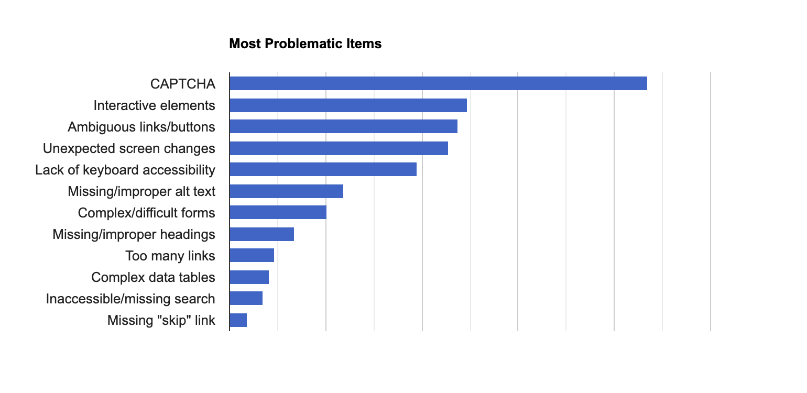
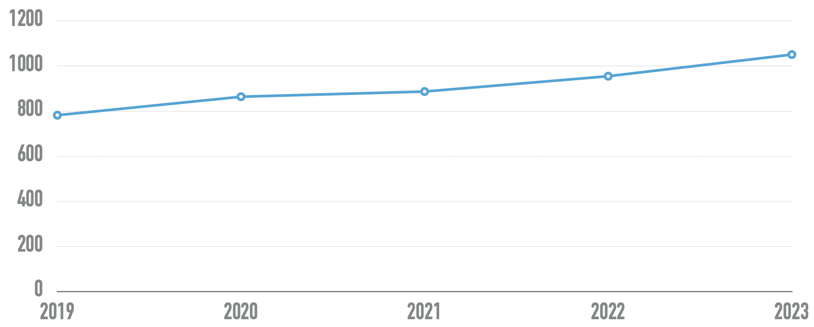

<h1 align="center"> Google Summer Of Code 2024 </h1>

<h2 align="center"> Improving  Alt Text Capabilities By Leveragingi AI-driven Alt Text Automation </h2>
<h3 align="center"> Neeraj P Yetheendran (NXPY) </h3>
-- --

# Table of content

1. Abstract
2. Project details and Implementation
3. documentation
4. Timeline and milestones
5. Extended ideas and stretch goals
6. About me
    

# Abstract
This proposal is based on the project idea provided in the [GSoC'24 project ideas list](https://github.com/wagtail/gsoc/blob/main/project-ideas.md)
Currently, Wagtail Users can use Custom Image Model to add an alt text field or by default uses filename/title as alt text. But this is not a recommended practice as [alt text should be tailored to the context where the image is used](https://www.ala.org/support/context-important-alt-text).
This proposal aims to build a robust, flexible solution to the problem, integrating the capability to add context specific alt text and enforcing them to ensure compliance with current Accessibility standards and promote Accessibility-first development. It also aims to explore the possibilities of integrating Computer Vision algorithms and LLM models to generate context specific alt text to ensure a more streamlined experience of adopting and integrating Accessibility practices.

## Current State
Adapting accessibility practices and prioritizing accessibility-first development are crucial for creating inclusive and user-friendly experiences. This approach ensures that everyone, regardless of ability, can access and interact with the website. By building with accessibility in mind, products become more intuitive and usable for everyone, from those using screen readers to even people with temporary limitations like a broken arm. This caters to a larger user base and plays an extremely crucial role in empowering them and raising awareness on their issues.

For example, consider this image ([source](https://arxiv.org/pdf/2305.14779.pdf)) that requires textual context to write accurate alt-text for. Without conditioning on the tweet text, the election flyers are indistinguishable from books to a traditional captioning system

		

In 2020, [WebAIM](https://webaim.org/) analyzed one million home pages for accessibility issues. According to their report:
- 98.1% Home Pages With At Least One WCAG 2.0 Failure
- Average Number of Errors Per Home Page was 60.9
- Missing Image Alt Text was one of the most common causes of accessibility failures (66%)
An estimated 1 Billion people have disabilities worldwide (including visual, hearing, motor, and cognitive).

According to a screen reader user survey conducted by WebAIM:
- Perception of the state of web accessibility decreased slightly since 2021. Respondents without disabilities tend to be more positive about recent progress (45.9% thought it has become more accessible) than those with disabilities (33.4% thought it has become more accessible).
	
- For the question: "Which of the following do you think would have a bigger impact on improvements to web accessibility?", more respondents have answered "better web sites" over time—68.6% of respondents in October 2009, 75.8% in December 2010, 81.3% in January 2014, 85.3% in 2021, and now 85.9% on this survey. This change may reflect improvements in assistive technology. It certainly indicates that users expect more accessible web sites.
	
- The majority (67%) of respondents never or rarely contact web site owners about barriers. Respondents without disabilities reported nearly the same likelihood to contact website owners as respondents with disabilities.
- After steady decreases in the frequent usage of landmarks/regions was seen from 2014 (43.8%) to 2021 (25.6%). In 2024 the reported frequent usage has now increased to 31.8%.
	
- The survey asked respondents to select their most, second most, and third most problematic items from a list. In giving each selected item a weighting, the following chart shows the overall rating of difficulty and frustration for each item.
	

	In order, the most problematic items are:
	1. CAPTCHA - images presenting text used to verify that you are a human user
	2. Interactive elements like menus, tabs, and dialogs do not behave as expected
	3. Links or buttons that do not make sense
	4. Screens or parts of screens that change unexpectedly
	5. Lack of keyboard accessibility
	6. **Images with missing or improper descriptions (alt text)**
	7. Complex or difficult forms
	8. Missing or improper headings
	9. Too many links or navigation items
	10. Complex data tables
	11. Inaccessible or missing search functionality
	12. Lack of "skip to main content" or "skip navigation" links

Providing text alternative for non-text content is a major part of ensuring accessibility to visually impaired users. The concept of alt text dates back to the early days of the internet, providing slow dial-up connections with a text alternative to downloading bandwidth-intensive images. Unfortunately, faster internet speeds made alt text less of a priority for many users. And since these descriptions needed to be added manually by whoever uploaded an image, many photos began to feature no alt text at all — with no recourse for the people who had relied on it. Common practices for ensuring accessibility through alternative text are specified in Web Content Accessibility Guidelines (WCAG) [SC 1.1.1](https://www.w3.org/WAI/WCAG21/Understanding/non-text-content) :
- Using aria-labelledby to provide a text alternative for non-text content
- When an image uses color differences to convey information, the text alternative for the image should convey that information. If not, this can cause problems for people who are blind or colorblind because they will not be able to perceive the information conveyed by the color differences.
- When the non-text content is updated, the text alternative should be updated at the same time. If the text in the text alternative cannot still be used in place of the non-text content without losing information or function, then it does not align to the guidelines because it is no longer a text alternative for the non-text content.
- If non-text content is time-based media, then text alternatives at least provide descriptive identification of the non-text content.
- If non-text content is a test or exercise that would be invalid if presented in [text](https://www.w3.org/WAI/WCAG21/Understanding/non-text-content#dfn-text), then text alternatives at least provide descriptive identification of the non-text content.
- If non-text content is primarily intended to create a [specific sensory experience](https://www.w3.org/WAI/WCAG21/Understanding/non-text-content#dfn-specific-sensory-experience), then text alternatives at least provide descriptive identification of the non-text content.
- If non-text content is [pure decoration](https://www.w3.org/WAI/WCAG21/Understanding/non-text-content#dfn-pure-decoration), is used only for visual formatting, or is not presented to users, then it is implemented in a way that it can be ignored by [assistive technology](https://www.w3.org/WAI/WCAG21/Understanding/non-text-content#dfn-assistive-technology).
- Charts, diagrams, audio recordings, pictures, and animations, text alternatives can make the same information available in a form that can be rendered through any modality (for example, visual, auditory or tactile). Short and long text alternatives can be used as needed to convey the information in the non-text content. Note that **prerecorded audio-only** and **prerecorded video-only** files are covered here
- If the text in the "text alternative" cannot be used in place of the non-text content without losing information or function then it fails because it is not, in fact, an alternative to the non-text content.
- When an image is used for decoration, spacing or other purpose that is not part of the meaningful content in the page then the image has no meaning and should be ignored by assistive technologies.
- Although ASCII art is implemented as a character string, its meaning comes from the pattern of glyphs formed by a visual presentation of that string, not from the text itself. Therefore ASCII art is non-text content and requires a text alternative. Text alternatives, or links to them, should be placed near the ASCII art in order to be associated with it.

### Preliminary Research
The adaption of accessibility features have gained more acceptance in the recent past. More effort has been made in the recent past to tackle the issue. 

Certain countries have also made specific legislation governing the need for websites serving their population to be accessible - for example [EN 301 549](https://www.etsi.org/deliver/etsi_en/301500_301599/301549/02.01.02_60/en_301549v020102p.pdf) in the EU, [Section 508 of the Rehabilitation Act](https://www.section508.gov/training/) in the US, [Federal Ordinance on Barrier-Free Information Technology](https://www.einfach-fuer-alle.de/artikel/bitv_english/) in Germany, the [Accessibility Regulations 2018](https://www.legislation.gov.uk/uksi/2018/952/introduction/made) in the UK, [Accessibilità](https://www.agid.gov.it/it/design-servizi/accessibilita) in Italy, the [Disability Discrimination Act](https://humanrights.gov.au/our-work/disability-rights/world-wide-web-access-disability-discrimination-act-advisory-notes-ver) in Australia, etc. The W3C keeps a list of [Web Accessibility Laws & Policies](https://www.w3.org/WAI/policies/) by country. 

The W3C has published a large and very detailed document that includes very precise, technology-agnostic criteria for accessibility conformance. These are called the [Web Content Accessibility Guidelines](https://www.w3.org/WAI/standards-guidelines/wcag/) (WCAG). The criteria are split up into four main categories, which specify how implementations can be made perceivable, operable, understandable, and robust. 

A majority of websites still do not adapt these practices (or adapt them partially). Across the one million home pages WebAIIM conducted an accessibility evaluation on, 49,991,225 distinct accessibility errors were detected—an average of 50.0 errors per page. 4.8% of all home page elements had a detected accessibility error. Users with disabilities would expect to encounter errors on 1 in every 21 home page elements with which they engage. 96.3% of home pages had detected WCAG 2 failures!. This improved very slightly from 96.8% in 2022. Over the last 4 years, the pages with detectable WCAG failures has decreased by only 1.5% from 97.8%. The home pages tested had over 1 billion page elements. Home page complexity increased significantly in 12 months, from an average of 955 elements in February 2022 to an average of 1050 elements per home page in February 2023 - a 10% increase.

The following chart shows the number of home page elements detected over the last five WebAIM Million studies:

Although detected errors have decreased slightly while page complexity has increased notably, the growth of home page elements at alarming rates hinders accessibility progress greatly.

The improper usage of alternative text is a major reason for these issues. There were over 43 million images in the sample, or 43.4 images per home page on average. The number of images increased a surprising 9.1% over the last year—home pages are becoming increasingly graphical. 22.1% of all home page images (9.6 per page on average) had missing alternative text (not counting alt=""). Over half of the images missing alternative text were linked images—resulting in links that were not descriptive. 10.9% of images with alternative text had questionable or repetitive alternative text—such as alt="image", "graphic", "blank", a file name, etc., or alternative text identical to adjacent text or alternative text.

Wagtail has made significant strides in the past to improve accessibility and promote accessibility-first practices. The [ATAG audit](https://github.com/thibaudcolas/rfcs/blob/99-atag-audit/text/089-atag-audit.md#a211-text-alternatives-for-rendered-non-text-content) and the [Accessibility team meeting notes](https://github.com/wagtail/accessibility/blob/main/team/2020-2023-meeting-notes.md#2023-12-22--more-team-members) gives an overview of the recent work in the field. Some recent significant changes include:
- [Accessibility Checker](https://wagtail.org/blog/introducing-wagtails-new-accessibility-checker/)
- Actionable steps towards WCAG Compliance
- Contrast Themes
- Testing based on pa11y 
- ATAG Audit Reports

Two of the failures found in the ATAG audit report was  [A.2.1.1 Text Alternatives for Rendered Non-Text Content](https://github.com/thibaudcolas/rfcs/blob/99-atag-audit/text/089-atag-audit.md#a211-text-alternatives-for-rendered-non-text-content) (Level A) and  [A.2.1.2 Alternatives for Rendered Time-Based Media](https://github.com/thibaudcolas/rfcs/blob/99-atag-audit/text/089-atag-audit.md#a212-alternatives-for-rendered-time-based-media) (Level A)

## Goals
The primary goal of this project is to make Wagtail and sites created by it more accessible and compliant with the WCAG by providing support for defining context specific alternate text considering current accessibility best practices, database modelling possibilities, and innovations in the realm of artificial intelligence to automate the creation of image descriptions. 

Some ways to achieve this are:
- Provide support for different LLMs  such as GPT-4, Mistral, Claude  using [`llm` plugins](https://llm.datasette.io/en/stable/plugins/directory.html)
- Provide setting for specifying AI backends
- Enhancing accessibility checker functionality to rate an image's alternate text 
- Ensuring alt text generation is cost-effective/negligible compared to overall site maintenance costs
- Ensuring solution for context specific alt text is frictionless as possible for both developers and editors
- Ensuring provision for context specific alt text addition does not require extra fields during model creation and also provides the capability to explicitly mark an image as decorative.
- Enforcing context specific alt text in compliance with WCAG by making `ImageBlock` with it required the default and rewriting documentation to reflect this change.

By the end of this project, we expect Wagtail to produce better results in the ATAG Audit and provide a frictionless solution for the problem.
## Benefits
- This helps people who have difficulty perceiving visual content. 
- Text alternatives may help some people who have difficulty understanding the meaning of photographs, drawings, and other images (e.g., line drawings, graphic designs, paintings, three-dimensional representations), graphs, charts, animations, etc.
- People who are deaf, are hard of hearing, or who are having trouble understanding audio information for any reason can read the text presentation. Research is ongoing regarding automatic translation of text into sign language.
- People who are deaf-blind can read the text in braille.
- Additionally, text alternatives support the ability to search for non-text content and to repurpose content in a variety of ways.
- By ensuring better accessibility practices are enforced, we move one step closer to an inclusive world.
- A large user base who's needs have been ignored and met with indifference historically will be less apprehensive about adopting technology as part of their daily life. 

Overall, better accessibility practices can lead to a more inclusive, considerate, and more accessible system.

# Project Plan and Implementation

**Note**: The code samples/snippets included are for demonstration purposes only; actual implementation could differ.

The fundamental issues a solution should consider are the following:
- Cost of various AI Backend options
- Cost of hosting alternate Open Source backends
- Database/Model design choices 
- Determining the context for an image
- Integration with Accessibility Checker
- Determining the extent of involvement and intervention of the content editor
- Determining Wagtail default implementation
- Text generation in different languages

## Relevant Research
There have been several works in the recent past exploring solutions to the problem of generating text using multimodal inputs. The creation of transformer models, Image encoders and language model decoders have made significant strides in developing solutions to tackle this issue. Here we'll be exploring how AI Models generate text from multimodal inputs to get a better idea on how our solution should be designed.

One method ( proposed in [Alt-Text with Context: Improving Accessibility for Images on Twitter](https://arxiv.org/abs/2305.14779)) is using an image encoder (in this case, CLIP (Radford et al., 2021)) to produce a vector embedding of the image which is then projected to a sequence of embeddings that occupy the same dimensionality as word embeddings and supplementing them with embedding of the contextual text (in this case, the tweet text)  in the hopes that these two information sources will provide meaningfully non-overlapping signal to the decoder, in order to produce more accurate captions.

The image $x$ is passed through a pretrained CLIP image encoder, and the output is projected to a word embedding space using a mapping network. This is parameterized by a multi-layer perceptron that takes in a 512 dimensional vector CLIP embedding and outputs a $k$ long sequence of 768 dimensional vectors (the same size GPT-2 expects for each token). These embeddings constitute a prefix $p$ which is the correct shape to be passed to GPT-2.

Having obtained $p$, a sequence of token embedding-esque vectors, the procedure for combining it with the tweet text to produce a prefix containing both visual and textual information is fairly straightforward. The projection is simply concatenated with the embedded tweet text t (note that they are both sequences in word embedding space) to obtain the complete prefix $p ⊕ t$. We can condition on this, treating it as something analogous to a multimodal prompt to our language model, which then autoregressively outputs the alt-text caption $\hat{y}$. Our decoder can therefore condition both on the tweet text, which is the same modality as its output, and the image itself which is not.

## AI Backend Options
A model solving the issue should be capable of handling multimodal inputs.

## Precedent Works

## 6. About Me

### Basic Information
- Name: Neeraj P Yetheendran
- Pronouns: He/Him
- Email: neeraj.yathy@gmail.com
- GitHub: https://github.com/NXPY123
- Time Zone: UTC+5:30 (IST - India)
- Working Hours: 6-8 hours per day, anytime from 8 am-3 pm and 6 pm-12 pm IST.
- Location: Thrissur, Kerala, India
- Degree: 3rd year, B.Tech (Computer Science)

I'm Neeraj P Yetheendran, Junior Computer Science and Engineering Undergrad at IIIT Kottayam. I'm passionate about Computer Science and writing. I pen down my thoughts on my [personal blog](https://medium.com/@neerajpy). I'm currently exploring the field of Back End Development, Software Development and DevOps. I'm comfortable with frameworks like Django,Flask and Express.js and SQL/NoSQL Databases. I have experience using AWS Services, Docker and a few  CI/CD tools. I have used these tools in the past to deliver multiple small scale projects as part of various organisations. I've also been a part of multiple small developer communities in the past. I'm a team player and would love to gain experience creating solutions to interesting problems together. I spend my free time reading books, playing around with the latest tech, playing videogames or football. I'm extremely passionate about Literature and lead a very active Literature Society in my college. I love debates, quizzes, movies and any form of literature in general.

I have worked on multiple small scale Open Source Projects before. I've been consistently contributing to Wagtail in the recent past and hope to make significant impactful contributions beneficial to the project and the community.

### Contributions in Wagtail

Few major contributions:
- [API for performantly bulk-creating pages programatically](https://github.com/wagtail/wagtail/pull/11480) (Ongoing)
- [Replace MouseTrap usage with built in Stimulus keyboard support](https://github.com/wagtail/wagtail/pull/11740) (Ongoing)
- [Prevent displaying model verbose_name in permissions UI for custom permissions](https://github.com/wagtail/wagtail/pull/11606)
- [Auto increment slugs on per model basis](https://github.com/wagtail/wagtail/pull/11396)
- [Avoid purging Revisions in use by third-party packages](https://github.com/wagtail/wagtail/pull/10961)
- [Allow subclasses of PagesAPIViewSet override default Page model](https://github.com/wagtail/wagtail/pull/10902)

_And a few more, you can check out the complete list [here](https://github.com/pulls?user=wagtail&q=is%3Apr+author%3ANXPY123+archived%3Afalse&user=wagtail)._

